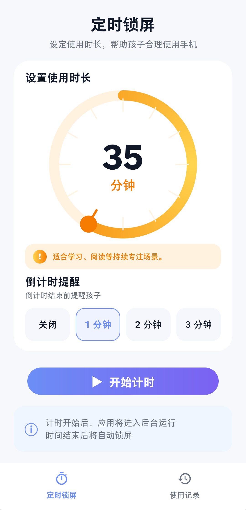
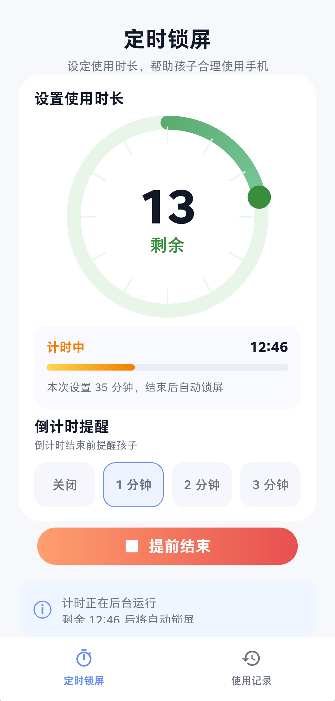
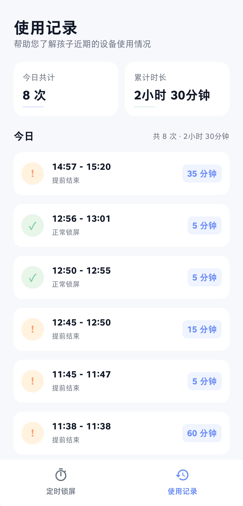

# Easy Locker (超简单锁屏)

> 一个极简的 Android 儿童定时锁屏工具，帮助家长合理控制孩子使用手机的时长。

[](LICENSE)
[](https://kotlinlang.org/)
[](https://developer.android.com/jetpack/compose)

## 项目介绍

Easy Locker 是一个专注于“定时自动锁屏”的本地工具 App。在家长将手机交给孩子前，设置一个倒计时，时间结束后 App 会自动锁定屏幕。

**核心理念：**
- **极简稳定**：不做复杂监控，只解决“约定时间到了就锁屏”的问题。
- **本地运行**：无需网络，无后台上传，保护隐私。
- **体验友好**：提供倒计时提醒，让孩子有心理准备，减少冲突。

## 界面截图

| 定时设置                                | 倒计时进行中                            | 使用记录                          |
|-------------------------------------|-----------------------------------|-------------------------------|
|  |  |  |

## 功能特性

- **灵活计时**：5-60 分钟圆形拨盘设置，5 分钟一档。
- **倒计时提醒**：支持提前 1/2/3 分钟全屏弹出提醒，防止孩子突然断开使用。
- **后台稳定**：使用 Foreground Service（前台服务）确保倒计时在后台不被系统杀死。
- **安全锁屏**：基于 Device Policy Manager 实现强制锁屏。
- **历史记录**：自动记录每次计时的开始、结束时间及状态（正常锁屏/提前结束）。
- **现代 UI**：基于 Jetpack Compose 开发，柔和配色，儿童友好。

## 技术栈

| 模块 | 技术 |
|---|---|
| 开发语言 | Kotlin |
| UI 框架 | Jetpack Compose |
| 架构模式 | MVVM |
| 数据库 | Room |
| 配置存储 | DataStore |
| 异步处理 | Coroutines & StateFlow |

## 项目结构

```text
app/
├── src/main/java/com/easylocker/
│   ├── data/          # Room 数据库、Repository、DataStore
│   ├── model/         # 数据模型与枚举
│   ├── receiver/      # 设备管理员广播接收器
│   ├── service/       # 前台计时服务
│   ├── ui/            # Compose 界面、Activity 与主题
│   ├── utils/         # 格式化工具类
│   └── viewmodel/     # 业务逻辑处理
└── src/main/res/      # 资源文件
```

## 环境要求

- Android SDK 26+ (Android 8.0 及以上)
- Android Studio Iguana 或更高版本
- Gradle 8.2+

## 本地快速开始

### 1. 克隆项目

```bash
git clone https://github.com/zhnglicho/easy-locker.git
cd easy-locker
```

### 2. 构建与运行

1. 使用 Android Studio 打开项目。
2. 等待 Gradle 同步完成。
3. 连接手机或模拟器，点击 **Run**。

## 使用说明

1. **授予权限**：首次启动必须根据引导开启“设备管理员权限”，否则无法执行锁屏操作。
2. **通知权限**：在 Android 13+ 设备上，请务必允许通知权限，以保证前台服务稳定运行。
3. **开始计时**：在拨盘上选择时长，点击“开始计时”后，您可以放心将手机交给孩子。

## 参与贡献

欢迎提交 Issue 或 Pull Request。

1. Fork 本项目。
2. 创建您的特性分支 (`git checkout -b feature/AmazingFeature`)。
3. 提交您的改动 (`git commit -m 'Add some AmazingFeature'`)。
4. 推送到分支 (`git push origin feature/AmazingFeature`)。
5. 开启一个 Pull Request。

## 开源协议

本项目使用 Apache License 2.0 开源协议，详情见 [LICENSE](LICENSE)。

## 关注公众号

|  微信公众号                                  |
|-------------------------------------|
|  |

## 联系方式


- GitHub: [@zhnglicho](https://github.com/zhnglicho)
- 主页: [https://github.com/zhnglicho](https://github.com/zhnglicho)
